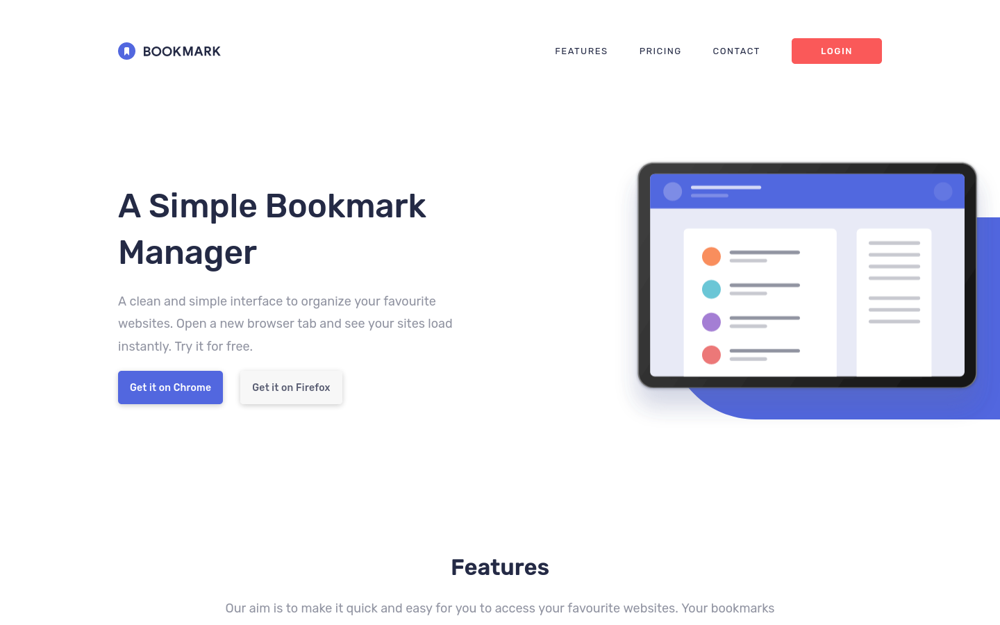

# Frontend Mentor - Bookmark landing page solution

This is a solution to the [Bookmark landing page challenge on Frontend Mentor](https://www.frontendmentor.io/challenges/bookmark-landing-page-5d0b588a9edda32581d29158). Frontend Mentor challenges help you improve your coding skills by building realistic projects. 

## Table of contents

- [Overview](#overview)
  - [The challenge](#the-challenge)
  - [Screenshot](#screenshot)
  - [Links](#links)
- [My process](#my-process)
  - [Built with](#built-with)
  - [What I learned](#what-i-learned)
  - [Continued development](#continued-development)
  - [Useful resources](#useful-resources)
- [Author](#author)
- [Acknowledgments](#acknowledgments)

**Note: Delete this note and update the table of contents based on what sections you keep.**

## Overview

### The challenge

Users should be able to:

- View the optimal layout for the site depending on their device's screen size
- See hover states for all interactive elements on the page
- Receive an error message when the newsletter form is submitted if:
  - The input field is empty
  - The email address is not formatted correctly

### Screenshot

### Links

- Solution URL: https://github.com/hebrerillo/bookmark-landing-challenge
- Live Site URL: https://bookmark-landing-challenge.netlify.app/

## My process

### Built with

- Semantic HTML5 markup
- CSS custom properties
- Flexbox
- CSS Grid
- Mobile-first workflow
- Vanilla JavaScript

### What I learned

I went deeper in the handling of popups with a fixed position, instead of absolute position like the rest of the challenges.

### Continued development

I am not sure if I am handling responsive images correctly, so I would love some feedback in that aspect.

### Useful resources

- https://developer.mozilla.org/en-US/ - As always, the Mozilla Developer Network is my favourite resource when I need help.

## Author

- Frontend Mentor - [@hebrerillo](https://www.frontendmentor.io/profile/hebrerillo)

## Acknowledgments

As always, the Mozilla Developer Network is my favourite resource when I need help.
